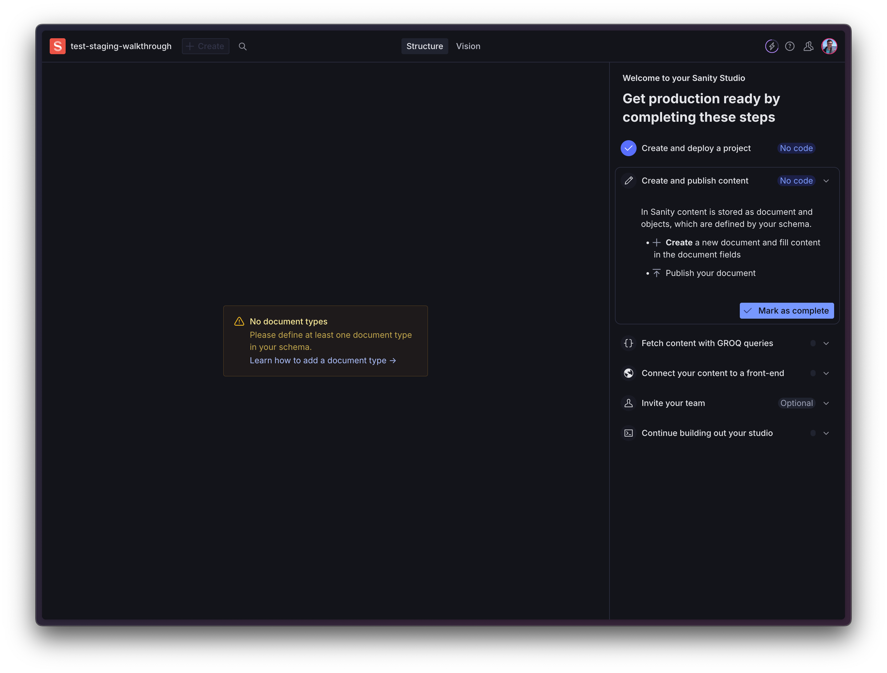

# sanity-plugin-walkthrough

This is a plugin for the Sanity Studio designed to help onboard new users through the basic functions and features of the product.

It adds a sidebar with a checklist of recommended steps to getting your Sanity studio up and running and production ready.



## Removing the plugin

This plugin should be removed automatically when you leave the online onboarding flow and install your studio locally. But in case it isn't, you can remove it by navigating to your `sanity.config.[js|ts]` file and removing it from the plugins array:

```ts
import {defineConfig} from 'sanity'
import {deskTool} from 'sanity/desk'
import {visionTool} from '@sanity/vision'
import {schemaTypes} from './schemas'
// Remove the import after uninstalling the package
import {walkthroughPlugin} from 'sanity-plugin-walkthrough'
// Remove the CSS for the walkthrough plugin 👇
import 'sanity-plugin-walkthrough/src/index.css'

export default defineConfig({
  name: 'default',
  title: 'test-staging-walkthrough',

  projectId: 'h5kquzzf',
  dataset: 'production',

  // Remove walkthroughPlugin from the plugins list 👇
  plugins: [deskTool(), visionTool(), walkthroughPlugin()],

  schema: {
    types: schemaTypes,
  },
})
```

## Development

Create a dummy test studio and see [this guide](https://arc.net/l/quote/paovovjp) for information about how to develop/test the plugin locally.

## Usage

Add it as a plugin in `sanity.config.ts` (or .js):

```ts
import {defineConfig} from 'sanity'
import {walkthroughPlugin} from 'sanity-plugin-walkthrough'
// Add the external CSS for the walkthrough plugin 👇
import 'sanity-plugin-walkthrough/src/index.css'

export default defineConfig({
  //...
  plugins: [walkthoughPlugin()],
})
```

## License

This project is UNLICENSED. Copyright belongs to Sanity, Inc.

## Develop & test

This plugin uses [@sanity/plugin-kit](https://github.com/sanity-io/plugin-kit)
with default configuration for build & watch scripts.

See [Testing a plugin in Sanity Studio](https://github.com/sanity-io/plugin-kit#testing-a-plugin-in-sanity-studio)
on how to run this plugin with hotreload in the studio.
